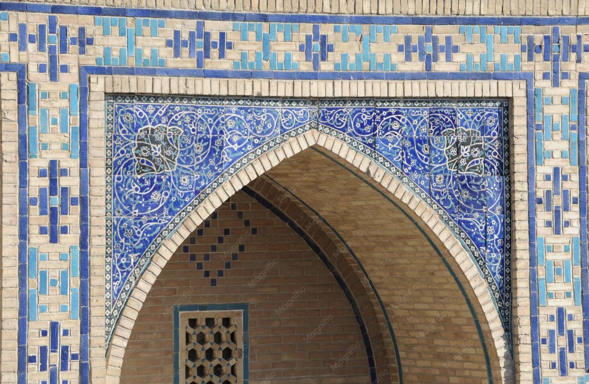

[Home](index.html) | [Topic](topic.html) | [Methodology](methodology.html) | [RDF Triples](rdf.html) | [SPARQL](sparql.html) | [Gaps](gaps.html) | [LLM Prompts](prompts.html) | [Challenges](challenges.html) | [Conclusion](conclusion.html)

---

# RDF Triples

After identifying the knowledge gaps and evaluating the outputs generated by ChatGPT and Gemini, we selected RDF triples that could enrich the Wikidata representation of the Mausoleum of Khoja Ahmed Yasawi.

These triples were designed to address the missing cultural, religious, and pilgrimage-related information identified during our SPARQL exploration.

---

# Missing Information #1

## Connection with the Yasawiyya Sufi Order

### Proposed RDF Triple

```rdf
:Mausoleum_of_Khoja_Ahmed_Yasawi
    :associatedWith
    :Yasawiyya_Sufi_Order .
```

### Explanation

Khoja Ahmed Yasawi was the founder of the Yasawiyya Sufi tradition.

Representing this relationship explicitly would improve the religious and historical context of the knowledge graph.

---

# Missing Information #2

## Representation as a Pilgrimage Site

### Proposed RDF Triple

```rdf
:Mausoleum_of_Khoja_Ahmed_Yasawi
    :hasFunction
    :Pilgrimage_Site .
```

### Explanation

The mausoleum is an important pilgrimage destination in Central Asia.

This social and religious role is currently underrepresented in Wikidata.

---

# Missing Information #3

## Spiritual and Religious Significance

### Proposed RDF Triple

```rdf
:Mausoleum_of_Khoja_Ahmed_Yasawi
    :associatedWith
    :Sufism .
```

### Explanation

The monument has strong connections with Islamic spirituality and Sufi traditions.

Representing this relationship would improve the semantic richness of the knowledge graph.

---

# Missing Information #4

## Related Religious Heritage Sites

### Proposed RDF Triple

```rdf
:Mausoleum_of_Khoja_Ahmed_Yasawi
    :relatedHeritageSite
    :Arystan_Bab_Mausoleum .
```

### Explanation

Arystan Bab is closely connected with the spiritual tradition surrounding Khoja Ahmed Yasawi.

Creating explicit links between related heritage sites would improve contextual navigation within the graph.

---

# Final RDF Enrichment

```rdf
:Mausoleum_of_Khoja_Ahmed_Yasawi
    :associatedWith
    :Yasawiyya_Sufi_Order .

:Mausoleum_of_Khoja_Ahmed_Yasawi
    :hasFunction
    :Pilgrimage_Site .

:Mausoleum_of_Khoja_Ahmed_Yasawi
    :associatedWith
    :Sufism .

:Mausoleum_of_Khoja_Ahmed_Yasawi
    :relatedHeritageSite
    :Arystan_Bab_Mausoleum .
```

---

# Knowledge Graph Perspective

These RDF triples enrich the knowledge graph by introducing:

- Religious relationships
- Pilgrimage functions
- Spiritual significance
- Heritage networks

As a result, the Wikidata representation of the Mausoleum of Khoja Ahmed Yasawi becomes more complete and semantically meaningful.
