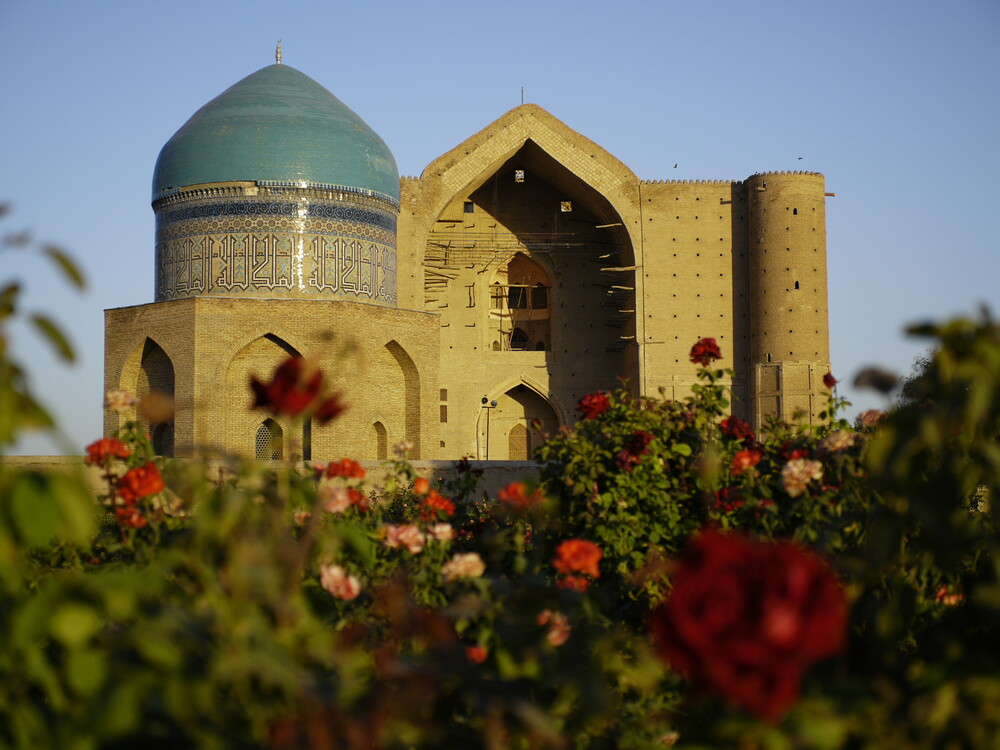

[Home](index.html) | [Topic](topic.html) | [Methodology](methodology.html) | [RDF Triples](rdf.html) | [SPARQL](sparql.html) | [Gaps](gaps.html) | [LLM Prompts](prompts.html) | [Challenges](challenges.html) | [Conclusion](conclusion.html)
---

# Mausoleum of Khoja Ahmed Yasawi
# Topic

Our project focuses on the **Mausoleum of Khoja Ahmed Yasawi**, a UNESCO World Heritage Site located in Turkistan, Kazakhstan.

The monument is important not only as an example of Timurid architecture, but also as a religious, spiritual, and cultural site connected with Sufism and the Yasawiyya tradition.

## Why We Chose This Topic

We chose this topic because the mausoleum represents a strong connection between:

- cultural heritage
- Islamic architecture
- Sufi tradition
- pilgrimage practices
- Kazakh and Central Asian identity

From the perspective of **Language, Society and Communication**, this project shows how cultural meaning can be transformed into structured digital knowledge.

## Research Question

How can Wikidata for the Mausoleum of Khoja Ahmed Yasawi be enriched through RDF triples and knowledge graph modeling?

## Main Objective

The main objective of this project is to identify missing semantic information in Wikidata and propose RDF triples that could improve the knowledge graph representation of the mausoleum.
